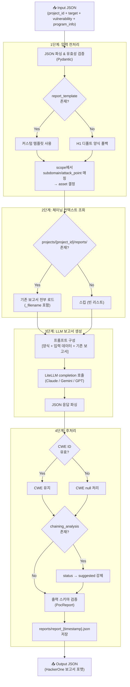

# Auto-PoC 내부 프로세스 구조

```mermaid
flowchart TD
    INPUT["📥 Input JSON\n(project_id + target + vulnerability + program_info)"]

    subgraph STEP1["1단계: 입력 전처리"]
        V["JSON 파싱 &amp; 유효성 검증\n(Pydantic)"]
        T{"report_template\n존재?"}
        TY["커스텀 템플릿 사용"]
        TN["H1 디폴트 양식 폴백"]
        A["scope에서\nsubdomain/attack_point 매칭\n→ asset 결정"]
    end

    subgraph STEP2["2단계: 체이닝 컨텍스트 조회"]
        R{"projects/{project_id}/reports/\n존재?"}
        RL["기존 보고서 전부 로드\n(_filename 포함)"]
        RS["스킵 (빈 리스트)"]
    end

    subgraph STEP3["3단계: LLM 보고서 생성"]
        P["프롬프트 구성\n[양식 + 입력 데이터 + 기존 보고서]"]
        L["LiteLLM completion 호출\n(Claude / Gemini / GPT)"]
        J["JSON 응답 파싱"]
    end

    subgraph STEP4["4단계: 후처리"]
        CWE{"CWE ID\n유효?"}
        CWEY["CWE 유지"]
        CWEN["CWE null 처리"]
        CH{"chaining_analysis\n존재?"}
        CHY["status → suggested 강제"]
        S["출력 스키마 검증\n(PocReport)"]
        SAVE["reports/report_{timestamp}.json\n저장"]
    end

    OUTPUT["📤 Output JSON\n(HackerOne 보고서 포맷)"]

    INPUT --> V
    V --> T
    T -->|Yes| TY
    T -->|No| TN
    TY --> A
    TN --> A

    A --> R
    R -->|Yes| RL
    R -->|No| RS

    RL --> P
    RS --> P
    P --> L
    L --> J

    J --> CWE
    CWE -->|Yes| CWEY
    CWE -->|No| CWEN
    CWEY --> CH
    CWEN --> CH
    CH -->|Yes| CHY
    CH -->|No| S
    CHY --> S
    S --> SAVE
    SAVE --> OUTPUT
```
